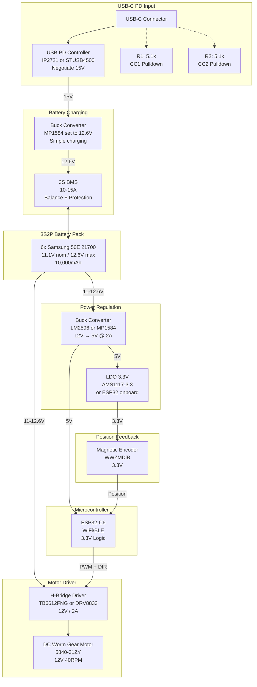
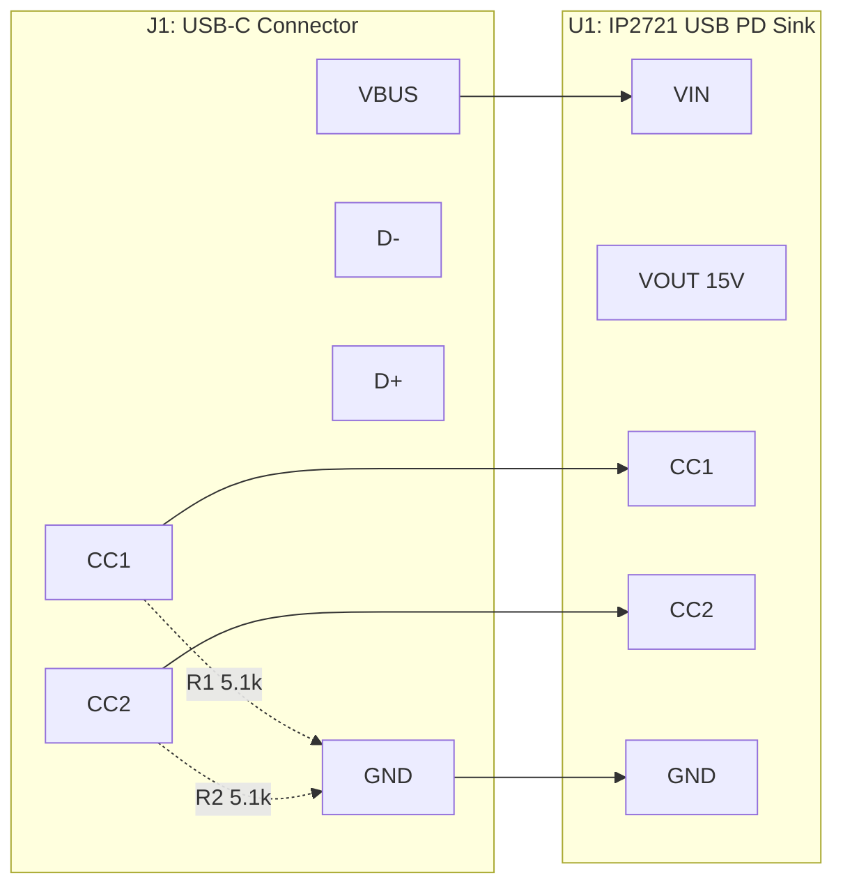
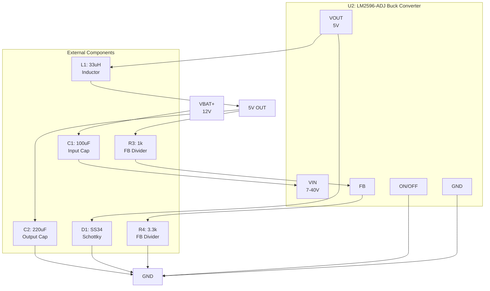
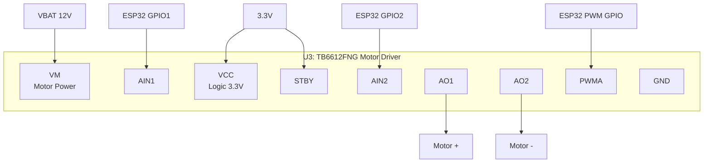
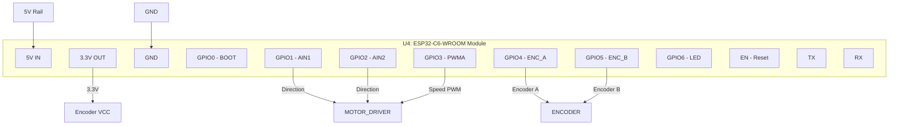
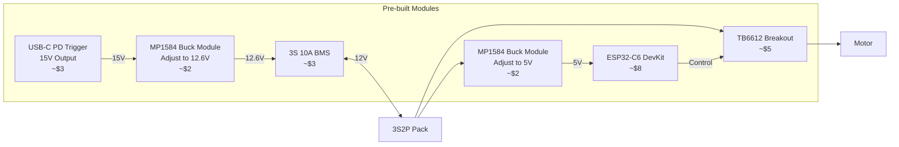

# Motorized Blinds Schematic

## System Block Diagram

## Detailed Wiring Schematic

## Power Section Detail

## Motor Driver Section

## ESP32-C6 Connections

## Bill of Materials

| Ref | Component | Value/Part | Purpose |
|-----|-----------|------------|---------|
| J1 | USB-C Connector | USB4110-GF-A | Power input |
| U1 | USB PD Controller | IP2721 or STUSB4500 | Negotiate 15V from USB-C PD |
| R1, R2 | Resistor | 5.1k 0603 | CC line pulldowns |
| - | 3S BMS | 10A 3S BMS | Battery protection + balance |
| - | Buck Converter (charging) | MP1584 set to 12.6V | Simple charging (BMS handles cutoff) |
| U2 | Buck Converter | LM2596-ADJ or MP1584 | 12V to 5V |
| C1 | Capacitor | 100uF 25V | Buck input |
| C2 | Capacitor | 220uF 10V | Buck output |
| L1 | Inductor | 33uH 3A | Buck inductor |
| D1 | Schottky Diode | SS34 | Buck freewheeling |
| R3 | Resistor | 1k | FB divider |
| R4 | Resistor | 3.3k | FB divider |
| U3 | Motor Driver | TB6612FNG | H-bridge driver |
| U4 | MCU | ESP32-C6-WROOM-1 | Main controller |
| C3, C4 | Capacitor | 10uF | Decoupling |
| C5, C6 | Capacitor | 100nF | Decoupling |
| - | Encoder | WWZMDiB Magnetic | Position feedback |
| M1 | Motor | 5840-31ZY 40RPM | Worm gear motor |

## Simplified Module-Based Build

If you want to use off-the-shelf modules instead of discrete components:

## GPIO Pin Assignment (ESP32-C6)

| GPIO | Function | Notes |
|------|----------|-------|
| GPIO0 | BOOT | Hold LOW during reset to enter bootloader |
| GPIO1 | Motor AIN1 | Direction control |
| GPIO2 | Motor AIN2 | Direction control |
| GPIO3 | Motor PWM | Speed control (LEDC) |
| GPIO4 | Encoder A | Quadrature input |
| GPIO5 | Encoder B | Quadrature input |
| GPIO6 | Status LED | Optional |
| GPIO7 | Limit Switch 1 | Optional - top limit |
| GPIO8 | Limit Switch 2 | Optional - bottom limit |
| GPIO21 | TX | Debug UART |
| GPIO20 | RX | Debug UART |

## Power Budget

| Component | Voltage | Current (typ) | Current (max) |
|-----------|---------|---------------|---------------|
| ESP32-C6 | 5V | 80mA | 500mA (WiFi TX) |
| Motor | 12V | 200mA | 600mA |
| Encoder | 3.3V | 10mA | 20mA |
| TB6612 | 3.3V | 1mA | 2mA |
| **Total from 12V** | - | ~300mA | ~700mA |
| **Total from 5V** | - | ~90mA | ~520mA |
